# Figures and Diagrams for the Colonic Transit Paper

## Saliency Maps
- True Positive case : positive_example.png
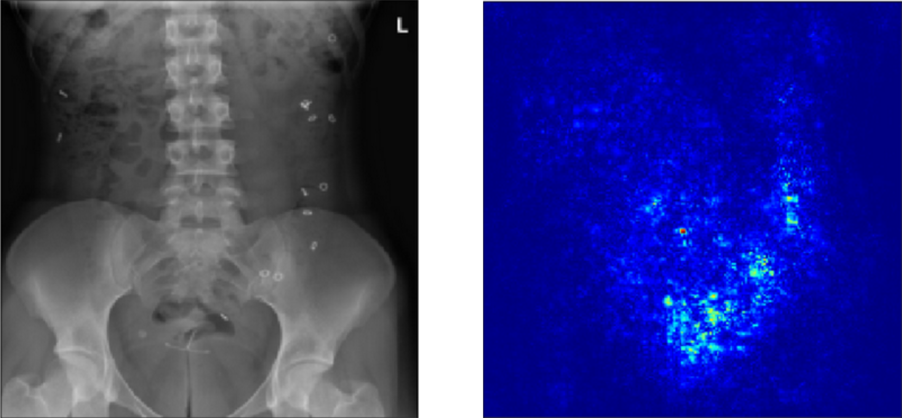 

- True Negative case : negative_example.png
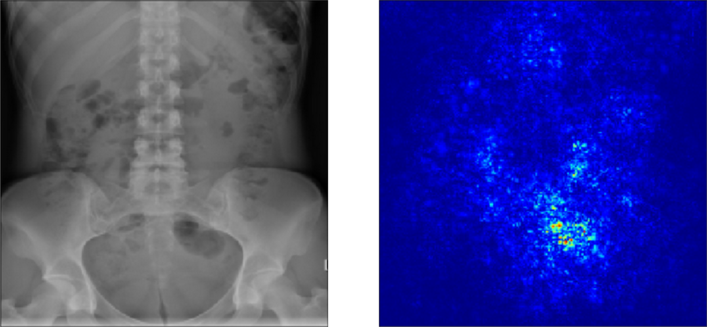

- False Positive case : false_positive_example.png
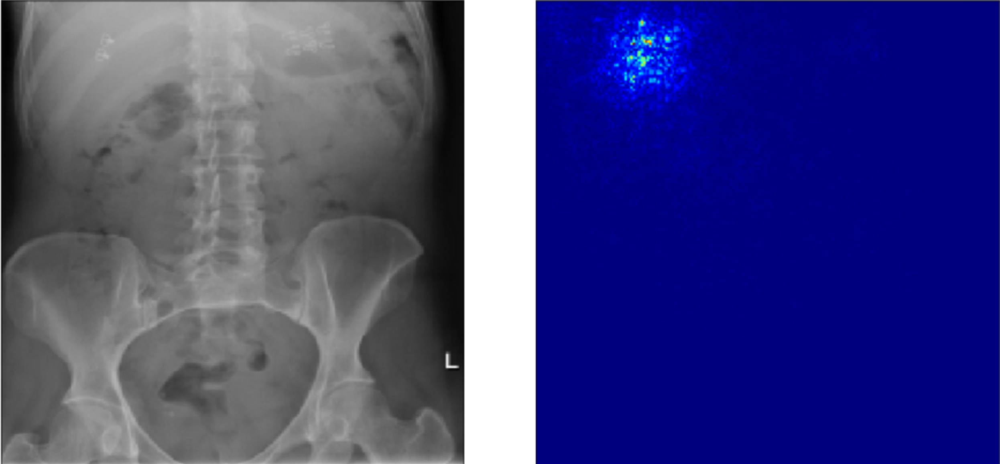

- False Negative case : false_negative_example.png
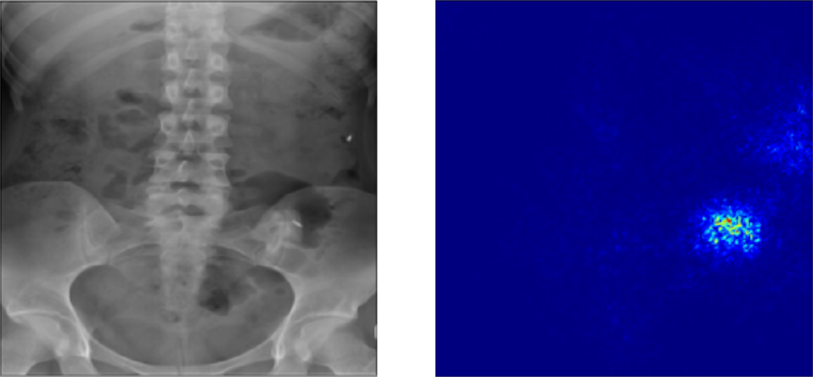

- Biased Training - all predictions incorrect 
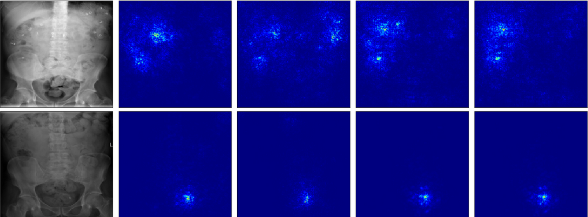

- Balanced Training - all predictions correct
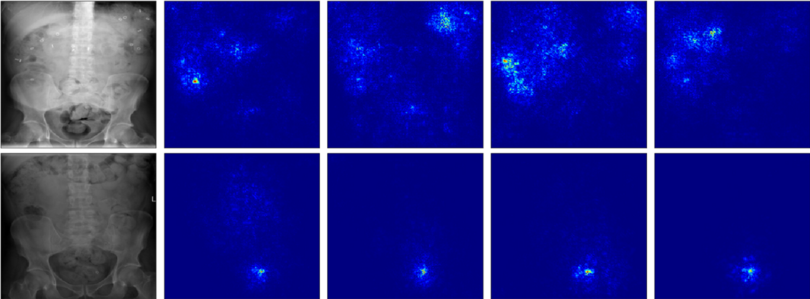

## Network Diagrams

- Baseline Network

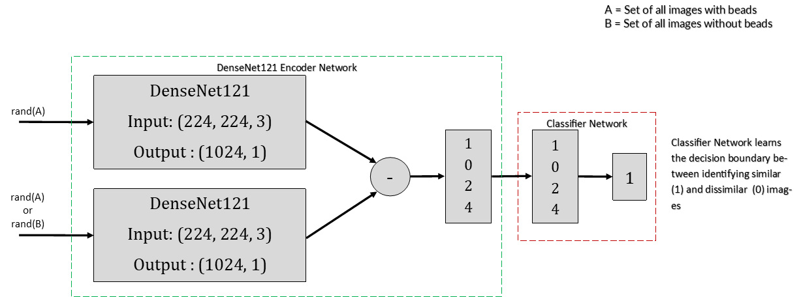

- Siamese Classifier
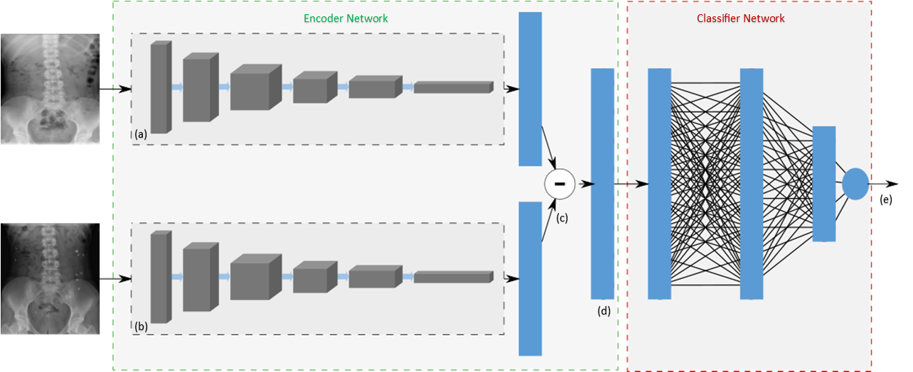

- Siamese Encoder + Gaussian Process
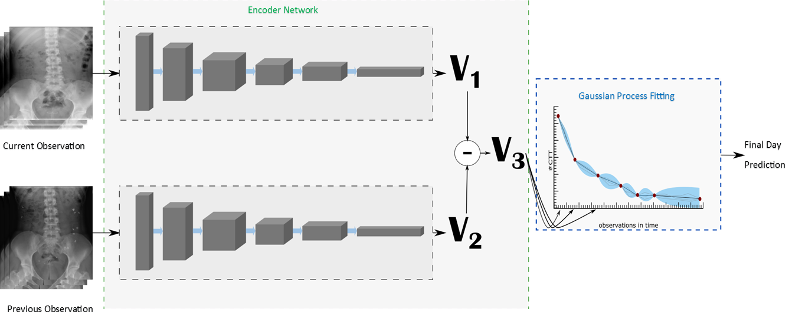

## Figures
** can be produced through notebook **

- PCA Figure

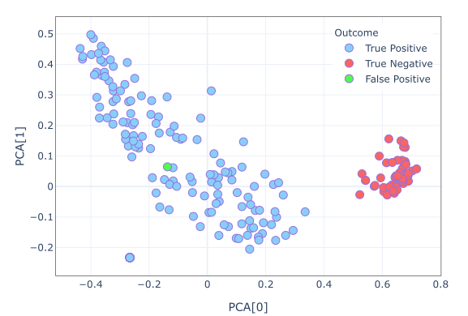

- GP Mean Absolute Error Comparison
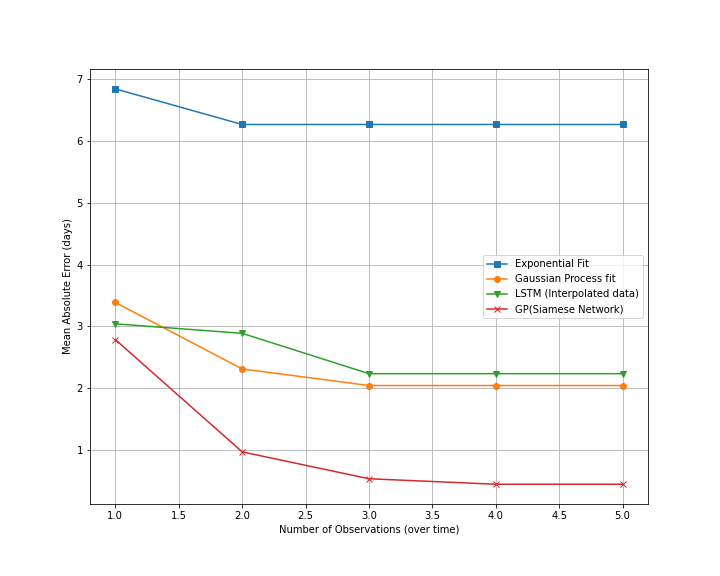

- Time to pass evolution with each observation
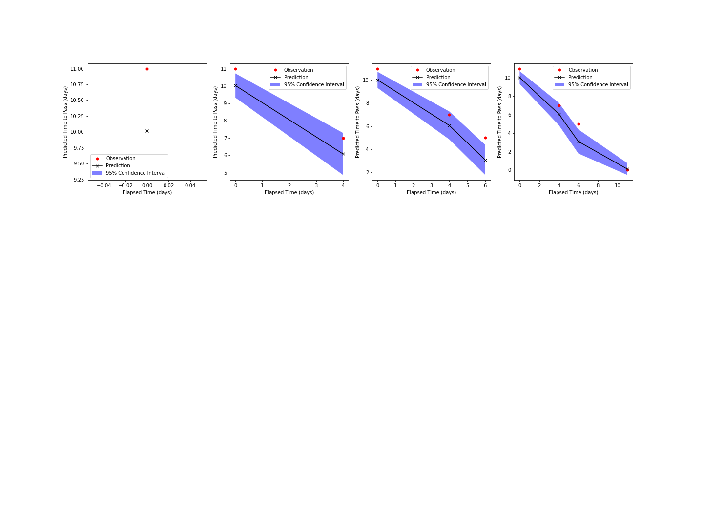